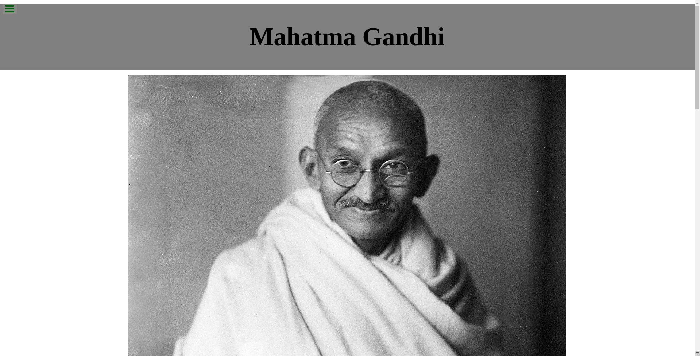

# FCC-Tribute_page

First FCC project

> FreeCodeCamp's project to create a tribute page. This tribute page is create in memory of Mahatma Gandhi.

Project was initially done on Codepen.io and later code is uploaded to github

## Built With

- HTML and CSS
- Git and github
- VS Code

## Live Demo

[Live Demo Link](https://raovikrant82.github.io/FCC-Tribute_page/)

## Authors

👤 **Author1**

- GitHub: [@raovikrant82](https://raovikrant82.github.io/FCC-Tribute_page/)
- Twitter: [@Imvikrantrao](https://twitter.com/Imvikrantrao)

## 🤝 Contributing

Contributions, issues, and feature requests are welcome!

Feel free to check the [issues page](../../issues/).

## Show your support

Give a ⭐️ if you like this project!

## 📝 License

This project is [MIT](./MIT.md) licensed.
